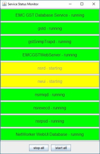
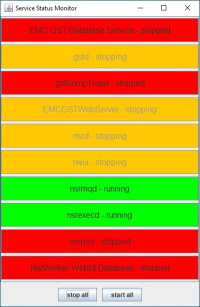
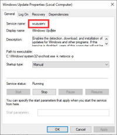

# ServiceMonitorApp
Service Monitor App for Windows




## Table of contents
* [General info](#general-info)
* [Technologies](#technologies)
* [Setup](#setup)

## General info
This project is simple service monitor for Windows.
	
## Technologies
Project is created with:
* IntelliJ IDEA
* JAVA 8 (JDK 1.8)
* Launch4j 3.5.0
	
## Setup
Copy ServiceMonitorApp.exe & services.txt to the directory of your choice.
It's important that both files are in the same directory!

Java should be available in one of the following system variables: %PATH% ; %JAVA_HOME% ; %NSR_JAVA_HOME%

services.txt
The entry in test.txt must exactly match the one in the service, including spaces!
A service can be ignored by an #

for NetWorker:
```
EMC GST Database Service
gstd
gstSnmpTrapd
EMCGSTWebServer
nsrd
nwui
nsrmqd
nsrexecd
nsrpsd
NetWorker WebUI Database
```



```
$ ...
```
